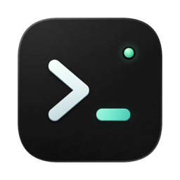

<p align="center">
  
</p>

<h1 align="center">Runode</h1>

<p align="center">
  给 AI 编程 agent 准备的 macOS 原生终端
  <br>
  <a href="#安装">下载</a>
  ·
  <a href="#快速上手">快速上手</a>
  ·
  <a href="CONTRIBUTING.md">参与开发</a>
  ·
  <a href="README.en.md">English</a>
</p>

## 简介

同时开几个 Claude Code、Codex，最累的是来回切终端，看哪个干完了、哪个在等你回答。Runode 不用配置任何 hook，自己就能认出每个终端里跑的是哪个 agent、处在什么状态，需要你的时候提醒你。agent 也能反过来操作旁边的终端，自己跑测试、读输出。出门在外，可以在手机上接着看。

Runode 用 [Ghostty](https://ghostty.org) 的 libghostty-vt 做终端仿真，用 [GPUI](https://www.gpui.rs) 绘制界面，全程 GPU 渲染。

## 特性

- **认得出 agent**：认出 Claude Code、Codex、Gemini CLI、Cursor、OpenCode、Amp 等二十多种 agent，在标签和侧栏上标出它在工作、在等你，还是干完了你还没看。
- **提醒与跳转**：你没在看时发通知、出提示音；`⌘⇧A` 列出所有窗口里的 agent，`⌘⌥A` 直接跳到下一个需要你的。
- **可编程**：自带 `runode` 命令行，能列出、读取、操作每个终端。agent 能用它在旁边的窗格跑命令、等结果、读输出，或者指挥另一个 agent。
- **会话常驻**：打开 `terminal-host` 后，会话由独立的宿主进程持有，退出、重开、升级 app 都不断。
- **手机远程**：iOS app 在局域网里和电脑配对，连接用 TLS 1.3 加密。在手机上能看终端、回复 agent、跑项目命令、提交 git。
- **项目面板**：文件树、带语法高亮的文件预览，加上仿 VS Code 的 Git 面板，能按块暂存、提交、切分支、推拉。
- **更顺手的命令行**：按 Tab 弹出带说明的补全，提示符上的输入实时高亮，按历史给出灰字建议。
- **兼容 Ghostty**：直接读你现有的 Ghostty 配置和主题。
- **原生**：Rust 写成，不是 Electron。界面有简体中文、繁体中文和英文，支持自动更新。

## 安装

下载对应芯片的 dmg：[Apple 芯片](https://github.com/runode-dev/runode/releases/latest/download/Runode-arm64.dmg) · [Intel](https://github.com/runode-dev/runode/releases/latest/download/Runode-x86_64.dmg)。打开后把 Runode 拖进「应用程序」。安装包用 Developer ID 签名并经过 Apple 公证，之后会自动更新。

历次版本见 [Releases](https://github.com/runode-dev/runode/releases)。iOS app 还没上架，需要[从源码构建](CONTRIBUTING.md)。

## 快速上手

在 Runode 的终端里，把 runode 的用法教给你的 agent：

```sh
runode setup claude    # 或 runode setup codex
```

之后 agent 会在需要时自己操作旁边的终端。你也可以亲手用：

```sh
runode list                                    # 列出所有终端和里面的 agent
runode send right 'cargo test' --enter --wait  # 在右边的窗格跑测试，等它结束
runode read right --command                    # 读回这条命令的输出
runode remote pair                             # 显示二维码，和手机配对
```

完整用法见 `runode help`。配置文件在 `~/.config/runode/config.conf`。

## 常见问题

**和 Ghostty 是什么关系？**
Runode 不是 Ghostty 的分支。它把 libghostty-vt 当作终端仿真的库来用，界面、分屏、agent 识别都是自己做的。

**支持哪些 agent？**
任何在终端里跑的 agent 都能用。其中二十多种能认出状态，包括 Claude Code、Codex、Gemini CLI、Cursor、OpenCode、Amp、GitHub Copilot、Kimi、Qwen Code 等。识别规则可以自己加。

**支持哪些平台？**
macOS（Apple 芯片和 Intel 都支持），另有 iOS app 做远程访问。

## 参与开发

欢迎提 issue 和 PR。构建方法见 [CONTRIBUTING.md](CONTRIBUTING.md)，代码结构和约定见 [AGENTS.md](AGENTS.md)。

## 许可

[Apache-2.0](LICENSE)
